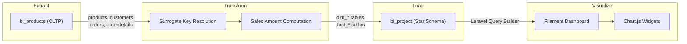
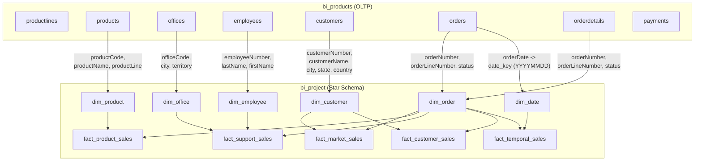
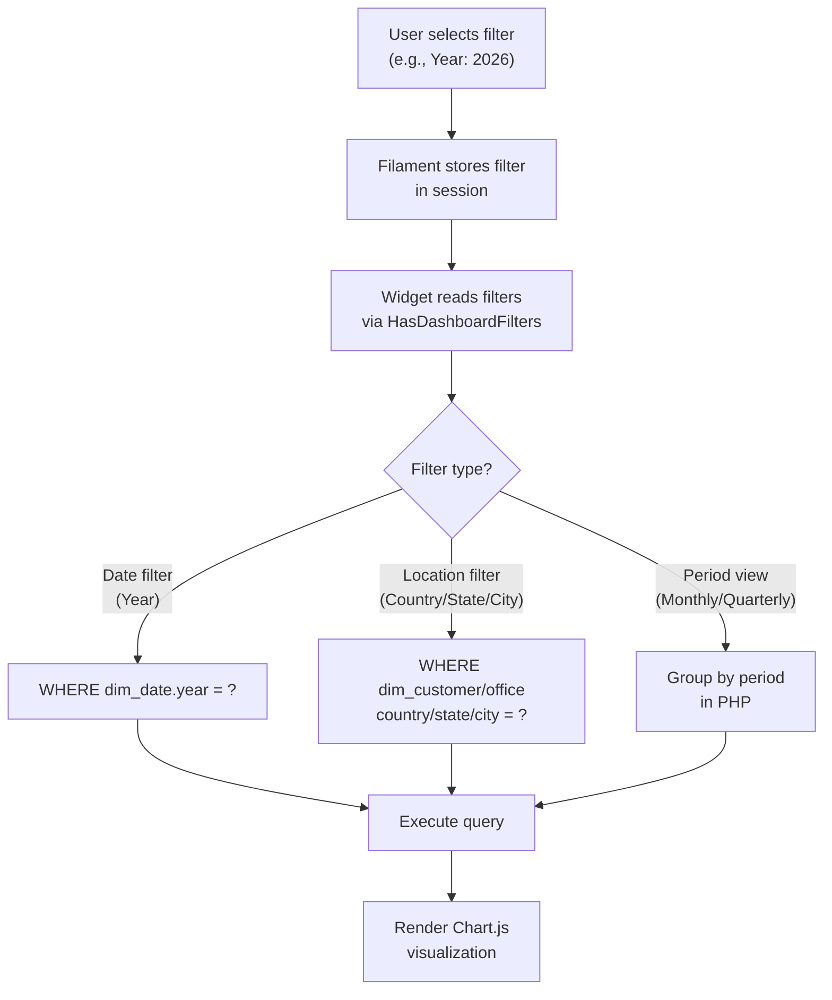
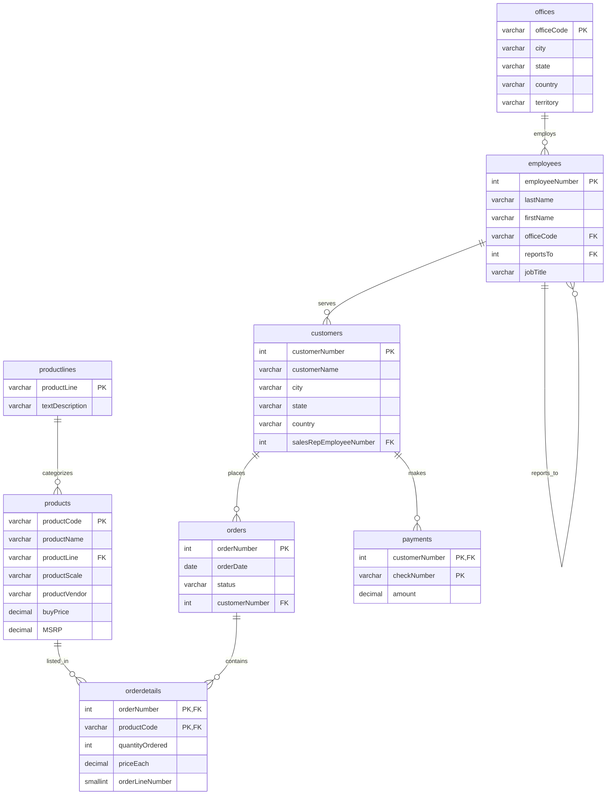
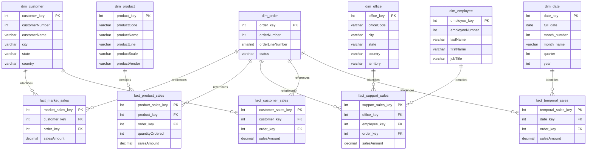
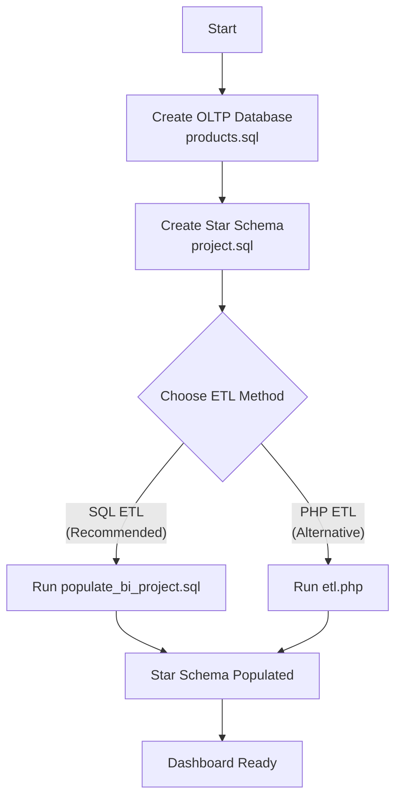
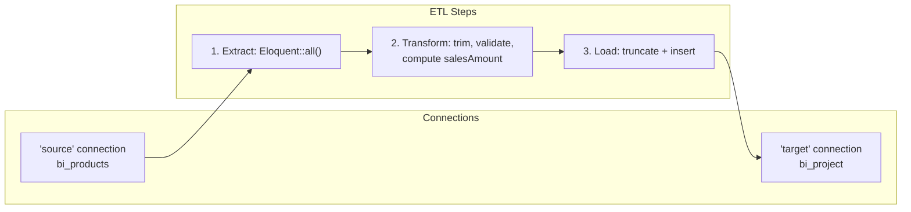
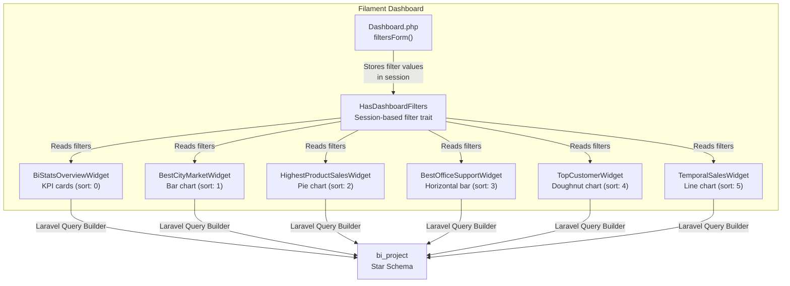

# Business Intelligence Project: Comprehensive Documentation

> A complete BI solution that transforms raw OLTP sales data into an interactive dashboard, answering five core analytical questions for a model car and collectibles company.

---

## Table of Contents

1. [Project Overview](#1-project-overview)
2. [Architecture and Data Flow](#2-architecture-and-data-flow)
3. [Technology Stack](#3-technology-stack)
4. [Database Schema: Star Schema Design](#4-database-schema-star-schema-design)
5. [ETL Pipeline](#5-etl-pipeline)
6. [Dashboard Application](#6-dashboard-application)
7. [The Five BI Questions](#7-the-five-bi-questions)
8. [User-Defined Files and Code](#8-user-defined-files-and-code)
9. [Setup and Installation](#9-setup-and-installation)
10. [Troubleshooting](#10-troubleshooting)

---

## 1. Project Overview

### 1.1 Purpose

This project answers **five business intelligence questions** by transforming raw operational data from an OLTP database into a star schema and visualizing the results through interactive charts. The analytical focus areas are summarized below:

| Question | BI Essence | Chart Type | Widget |
|----------|-----------|------------|--------|
| A: Which city is the best market for sales? | Geographic market analysis | Bar | `BestCityMarketWidget` |
| B: Which product has the highest sales? | Product performance analysis | Pie | `HighestProductSalesWidget` |
| C: Which office provides the best sales support? | Organizational performance | Horizontal Bar | `BestOfficeSupportWidget` |
| D: Which customer generates the highest revenue? | Customer value analysis | Doughnut | `TopCustomerWidget` |
| E: Which year/month had the highest sales volume? | Temporal trend analysis | Line | `TemporalSalesWidget` |

### 1.2 High-Level Architecture

The system follows a classic ETL pattern: data is extracted from an OLTP source database (`bi_products`), transformed through surrogate key resolution, and loaded into an analytical star schema (`bi_project`). A Laravel-Filament dashboard consumes the star schema through parameterized queries, presenting the results as interactive Chart.js visualizations.



### 1.3 Project Directory Structure

```
project/
├── BI-PROJECT-DOCUMENTATION.md          # This file
├── ETL/                                 # Data pipeline
│   ├── products.sql                     # Creates bi_products OLTP database
│   ├── project.sql                      # Creates bi_project star schema
│   ├── populate_bi_project.sql          # SQL-based ETL (primary method)
│   ├── etl.php                          # PHP-based ETL (alternative method)
│   ├── bootstrap.php                    # Laravel Capsule setup for ETL
│   ├── composer.json                    # ETL dependencies
│   ├── models/                          # Eloquent models for ETL
│   │   ├── Source*.php                  # Models for bi_products tables
│   │   └── Dim*.php                     # Models for bi_project tables
│   └── a.sql - e.sql                    # Individual question ETL scripts
├── dashboard/                           # Visualization layer
│   ├── app/Filament/
│   │   ├── Pages/Dashboard.php          # Dashboard page with filters
│   │   └── Widgets/
│   │       ├── Concerns/HasDashboardFilters.php  # Filter trait
│   │       ├── BiStatsOverviewWidget.php         # KPI cards
│   │       ├── BestCityMarketWidget.php          # Chart A
│   │       ├── HighestProductSalesWidget.php     # Chart B
│   │       ├── BestOfficeSupportWidget.php       # Chart C
│   │       ├── TopCustomerWidget.php             # Chart D
│   │       └── TemporalSalesWidget.php           # Chart E
│   └── Providers/Filament/
│       └── AdminPanelProvider.php               # Panel configuration
```

---

## 2. Architecture and Data Flow

### 2.1 End-to-End Data Flow

The data pipeline operates in three discrete phases. During extraction, the ETL process reads normalized OLTP tables from the `bi_products` database. Transformation resolves natural keys (e.g., `customerNumber`, `productCode`) into surrogate keys (e.g., `customer_key`, `product_key`) and computes derived measures such as `salesAmount`. Loading populates the star schema in the `bi_project` database.



### 2.2 Filter System Flow

The dashboard implements a session-based filter mechanism. When a user selects a filter value (e.g., Year: 2026), the filter is stored in the session via Filament's built-in filter handling. Each widget reads the current filter state through the `HasDashboardFilters` trait and applies the corresponding WHERE clauses to its query.



---

## 3. Technology Stack

| Layer | Technology | Version | Purpose |
|-------|-----------|---------|---------|
| Database | MySQL | 8.x | Star schema storage |
| Backend | Laravel | 12 | PHP framework, query builder |
| Frontend | Filament | v4 | Admin panel, widgets |
| Reactive | Livewire | v3 | Real-time filter updates |
| Charts | Chart.js | 4.x | Interactive visualizations |
| UI | Alpine.js | 3.x | DOM interactivity |
| Styling | Tailwind CSS | 3.x | Utility-first CSS |
| PHP | PHP | 8.2+ | Runtime |

---

## 4. Database Schema: Star Schema Design

### 4.1 Source Schema: `bi_products` (OLTP)

The source database follows a normalized OLTP design with eight tables:



### 4.2 Target Schema: `bi_project` (Star Schema)

The analytical database uses a star schema optimized for read-heavy aggregations. Five separate fact tables are used, each optimized for a specific analytical question. This design avoids unnecessary joins when answering any single question.



### 4.3 Dimension Tables

| Table | Primary Key | Key Columns | Purpose |
|-------|------------|-------------|---------|
| `dim_customer` | `customer_key` (INT, AUTO_INCREMENT) | customerNumber, customerName, city, state, country | Customer attributes |
| `dim_order` | `order_key` (INT, AUTO_INCREMENT) | orderNumber, orderLineNumber, status | Order line details |
| `dim_product` | `product_key` (INT, AUTO_INCREMENT) | productCode, productName, productLine, productScale, productVendor | Product catalog |
| `dim_office` | `office_key` (INT, AUTO_INCREMENT) | officeCode, city, state, country, territory | Office locations |
| `dim_employee` | `employee_key` (INT, AUTO_INCREMENT) | employeeNumber, lastName, firstName, jobTitle | Employee information |
| `dim_date` | `date_key` (INT, YYYYMMDD) | full_date, month_number, month_name, quarter, year | Date dimension |

### 4.4 Fact Tables

| Table | Primary Key | Foreign Keys | Measures | Grain |
|-------|------------|-------------|----------|-------|
| `fact_market_sales` | `market_sales_key` | customer_key, order_key | salesAmount | One row per order line |
| `fact_product_sales` | `product_sales_key` | product_key, order_key | quantityOrdered, salesAmount | One row per order line |
| `fact_support_sales` | `support_sales_key` | office_key, employee_key, order_key | salesAmount | One row per order line |
| `fact_customer_sales` | `customer_sales_key` | customer_key, order_key | salesAmount | One row per order (aggregated) |
| `fact_temporal_sales` | `temporal_sales_key` | date_key, order_key | salesAmount | One row per order line |

### 4.5 Key Design Decisions

- **Surrogate keys** (`customer_key`, `product_key`, etc.) replace natural keys for faster joins and source-system independence.
- **`salesAmount`** is computed as `quantityOrdered x priceEach` during ETL, not at query time, pre-computed for performance.
- **`date_key`** uses a `YYYYMMDD` integer format for efficient date dimension lookups.
- **Separate fact tables** per analytical question optimize each query path, since each question joins only the tables it needs.

---

## 5. ETL Pipeline

### 5.1 Overview

The ETL pipeline extracts data from the `bi_products` OLTP database and loads it into the `bi_project` star schema. Two implementation methods are available:

1. **SQL-based ETL** (`populate_bi_project.sql`) -- the primary method, executed directly in MySQL
2. **PHP-based ETL** (`etl.php`) -- an alternative method using Laravel Eloquent models via Capsule



### 5.2 Source Data Scope

| Dimension | Coverage | Records |
|-----------|----------|---------|
| Time | January 2026 -- December 2026 (plus 2025) | 15 distinct order dates |
| Customers | France, USA, Australia, Norway | 5 |
| Products | Classic Cars, Motorcycles, Planes, Laptops | 10 |
| Offices | San Francisco (CA), Boston (MA) | 2 |
| Orders | 36 (2026) + 12 (2025) | 48 total |

### 5.3 SQL-Based ETL: `populate_bi_project.sql`

The primary ETL method operates in two phases: dimension loads followed by fact loads. Dimensions are populated first to establish the surrogate key mappings that fact tables reference.

**Execution steps:**

```bash
# Step 1: Create source OLTP database
mysql -u root -p1234 < ETL/products.sql

# Step 2: Create star schema
mysql -u root -p1234 < ETL/project.sql

# Step 3: Run ETL
mysql -u root -p1234 < ETL/populate_bi_project.sql
```

**Dimension load pattern:**

```sql
-- Example: dim_customer
INSERT INTO dim_customer (customerNumber, customerName, city, state, country)
SELECT customerNumber, customerName, city, state, country
FROM bi_products.customers;
```

**Fact load pattern (salesAmount computation):**

```sql
-- Example: fact_market_sales
INSERT INTO fact_market_sales (customer_key, order_key, salesAmount)
SELECT
    dc.customer_key,           -- Surrogate key from dim_customer
    do.order_key,              -- Surrogate key from dim_order
    (od.quantityOrdered * od.priceEach) AS salesAmount  -- Computed measure
FROM bi_products.orderdetails od
    JOIN bi_products.orders o ON od.orderNumber = o.orderNumber
    JOIN dim_customer dc ON o.customerNumber = dc.customerNumber
    JOIN dim_order do ON o.orderNumber = do.orderNumber
        AND od.orderLineNumber = do.orderLineNumber;
```

**Cross-table join for `fact_support_sales`:**

```sql
-- Traces: orderdetails -> orders -> customers -> employees -> offices
INSERT INTO fact_support_sales (office_key, employee_key, order_key, salesAmount)
SELECT
    df.office_key,
    de.employee_key,
    do.order_key,
    (od.quantityOrdered * od.priceEach) AS salesAmount
FROM bi_products.orderdetails od
    JOIN bi_products.orders o ON od.orderNumber = o.orderNumber
    JOIN bi_products.customers c ON o.customerNumber = c.customerNumber
    JOIN bi_products.employees e ON c.salesRepEmployeeNumber = e.employeeNumber
    JOIN dim_employee de ON e.employeeNumber = de.employeeNumber
    JOIN dim_office df ON e.officeCode = df.officeCode
    JOIN dim_order do ON od.orderNumber = do.orderNumber
        AND od.orderLineNumber = do.orderLineNumber;
```

### 5.4 PHP-Based ETL: `etl.php`

The alternative ETL uses Laravel Eloquent models with two database connections (`source` for OLTP, `target` for star schema). The PHP approach builds lookup maps using `pluck()` then resolves foreign keys in PHP loops.

**Architecture:**



**Key difference from SQL ETL:** The PHP method builds in-memory lookup maps, then resolves foreign keys in PHP:

```php
// Build lookup map
$productMap = DimProduct::pluck('product_key', 'productCode')->toArray();

// Resolve foreign keys
foreach ($details as $d) {
    $pkey = $productMap[$d['productCode']] ?? null;
    $okey = $orderMap[$d['orderNumber'] . '|' . $d['orderLineNumber']] ?? null;
    // Insert fact row with surrogate keys
}
```

**Bootstrap configuration (dual connections):**

```php
// bootstrap.php
$capsule->addConnection([...], 'source');  // bi_products (OLTP)
$capsule->addConnection([...], 'target');  // bi_project (star schema)
```

### 5.5 ETL Model Files

| File | Connection | Table | Purpose |
|------|-----------|-------|---------|
| `models/SourceProduct.php` | `source` | `products` | Read from OLTP |
| `models/SourceOffice.php` | `source` | `offices` | Read from OLTP |
| `models/SourceEmployee.php` | `source` | `employees` | Read from OLTP |
| `models/SourceCustomer.php` | `source` | `customers` | Read from OLTP |
| `models/SourceOrder.php` | `source` | `orders` | Read from OLTP |
| `models/SourceOrderDetail.php` | `source` | `orderdetails` | Read from OLTP |
| `models/DimProduct.php` | `target` | `dim_product` | Write to star schema |
| `models/DimOffice.php` | `target` | `dim_office` | Write to star schema |
| `models/DimEmployee.php` | `target` | `dim_employee` | Write to star schema |
| `models/DimCustomer.php` | `target` | `dim_customer` | Write to star schema |
| `models/DimOrder.php` | `target` | `dim_order` | Write to star schema |
| `models/DimDate.php` | `target` | `dim_date` | Write to star schema |

---

## 6. Dashboard Application

### 6.1 Architecture Overview

The dashboard is a Laravel 12 + Filament v4 application with top navigation (no sidebar). It uses Livewire v3 for reactive components and Chart.js for visualizations.



### 6.2 Dashboard Layout

The dashboard uses Filament's `topNavigation(true)` configuration, which replaces the default sidebar with a top navigation bar. The dashboard page defines two collapsible filter sections:

1. **Date Filters:** Year, Period View (Monthly/Quarterly/Semi-Annual/Annual)
2. **Location Filters:** Country, State/Province, City, Territory

Widget sort order determines the visual layout:

| Sort | Widget | Description |
|------|--------|-------------|
| 0 | BiStatsOverviewWidget | KPI summary cards (top) |
| 1 | BestCityMarketWidget | Chart A: Sales by city |
| 2 | HighestProductSalesWidget | Chart B: Sales by product |
| 3 | BestOfficeSupportWidget | Chart C: Sales by office |
| 4 | TopCustomerWidget | Chart D: Sales by customer |
| 5 | TemporalSalesWidget | Chart E: Sales over time (bottom) |

### 6.3 Widget Query Patterns

Each widget queries the star schema via Laravel's query builder and returns Chart.js-compatible data structures:

```php
// Typical widget getData() pattern
protected function getData(): array
{
    $data = DB::connection('mysql')
        ->table('fact_*_sales')
        ->join('dim_*', ...)
        ->select('dimension_attribute', DB::raw('SUM(salesAmount) as total_sales'))
        ->groupBy('dimension_attribute')
        ->orderByDesc('total_sales')
        ->get();

    return [
        'datasets' => [
            ['label' => 'Total Sales', 'data' => $data->pluck('total_sales')->toArray()],
        ],
        'labels' => $data->pluck('dimension_attribute')->toArray(),
    ];
}
```

---

## 7. The Five BI Questions

### 7.1 Question A: Best Market by City (Geographic Analysis)

**BI Essence:** Where does the money come from?

**File:** `BestCityMarketWidget.php`

**Query Logic:**

```sql
SELECT dim_customer.city, SUM(fact_market_sales.salesAmount) as total_sales
FROM fact_market_sales
    JOIN dim_customer ON fact_market_sales.customer_key = dim_customer.customer_key
GROUP BY dim_customer.city
ORDER BY total_sales DESC
```

**Visualization:** Bar chart for easy city-to-city comparison.

**Filters:** Country (independent widget-level filter + dashboard-level Country/State/City filters).

### 7.2 Question B: Highest Sales by Product (Product Performance)

**BI Essence:** What sells best?

**File:** `HighestProductSalesWidget.php`

**Query Logic:**

```sql
SELECT dim_product.productName, SUM(fact_product_sales.salesAmount) as total_sales
FROM fact_product_sales
    JOIN dim_product ON fact_product_sales.product_key = dim_product.product_key
    JOIN dim_order ON fact_product_sales.order_key = dim_order.order_key
GROUP BY dim_product.productName
ORDER BY total_sales DESC
```

**Visualization:** Pie chart showing product share of total sales.

**Filters:** Product Line (independent widget filter), with cross-fact location filtering via `getMatchingOrderNumbers()` subquery against `fact_market_sales`.

### 7.3 Question C: Best Office Sales Support (Organizational Performance)

**BI Essence:** Which office drives sales?

**File:** `BestOfficeSupportWidget.php`

**Query Logic:**

```sql
SELECT dim_office.city, SUM(fact_support_sales.salesAmount) as total_sales
FROM fact_support_sales
    JOIN dim_office ON fact_support_sales.office_key = dim_office.office_key
GROUP BY dim_office.officeCode, dim_office.city
ORDER BY total_sales DESC
```

**Data chain:** Order -> Customer -> Sales Rep -> Office.

**Visualization:** Horizontal bar chart (`indexAxis: 'y'`) for ranked office comparison.

**Filters:** Country, State, City, Territory (from `dim_office`).

### 7.4 Question D: Top Customer Revenue (Customer Value Analysis)

**BI Essence:** Who are the best customers?

**File:** `TopCustomerWidget.php`

**Query Logic:**

```sql
SELECT dim_customer.customerName, SUM(fact_customer_sales.salesAmount) as total_sales
FROM fact_customer_sales
    JOIN dim_customer ON fact_customer_sales.customer_key = dim_customer.customer_key
GROUP BY dim_customer.customerName, dim_customer.city, dim_customer.state, dim_customer.country
ORDER BY total_sales DESC
```

**Visualization:** Doughnut chart showing proportional customer contribution.

**Filters:** Country, State, City (from `dim_customer`).

### 7.5 Question E: Sales Volume Over Time (Temporal Trend Analysis)

**BI Essence:** When did sales peak?

**File:** `TemporalSalesWidget.php`

**Query Logic:**

```sql
SELECT dim_date.year, dim_date.month_name, dim_date.quarter,
       SUM(fact_temporal_sales.salesAmount) as total_sales
FROM fact_temporal_sales
    JOIN dim_date ON fact_temporal_sales.date_key = dim_date.date_key
GROUP BY dim_date.year, dim_date.month_number, dim_date.month_name, dim_date.quarter
```

**Visualization:** Line chart with area fill for trend visualization.

**Filters:** Year (dropdown), Period View (Monthly/Quarterly/Semi-Annual/Annual).

**Period Aggregation Logic:**

The `groupByPeriod()` method handles temporal aggregation in PHP:

```php
// Monthly: "January 2026", "February 2026", ...
// Quarterly: "Q1 2026", "Q2 2026", ...
// Semi-Annual: "H1 2026", "H2 2026", ...
// Annual: "2026"
```

---

## 8. User-Defined Files and Code

### 8.1 Core Application Files

#### `app/Filament/Pages/Dashboard.php`

**Purpose:** Customizes the Filament dashboard page with filter forms.

**Key method:** `filtersForm(Schema $schema)` defines six filter selects organized into two sections:

- **Date Filters:** Year (from `dim_date`), Period View (hardcoded options)
- **Location Filters:** Country, State, City, Territory (merged from `dim_customer` and `dim_office`)

The method queries dimension tables for distinct filter values and merges customer and office location data using `array_unique(array_merge(...))`.

#### `app/Filament/Widgets/Concerns/HasDashboardFilters.php`

**Purpose:** Shared trait that reads dashboard filters from the session.

```php
trait HasDashboardFilters
{
    protected function getDashboardFilters(): array
    {
        return session()->get(
            md5(Dashboard::class) . '_filters',
            []
        );
    }
}
```

**Used by:** All 6 widgets to read the current filter state.

#### `app/Filament/Widgets/BiStatsOverviewWidget.php`

**Purpose:** Displays 4 KPI summary cards at the top of the dashboard.

**KPI Cards:**

1. **Total Revenue** -- Sums `salesAmount` (via `fact_temporal_sales` or `fact_market_sales` depending on year filter), includes a sparkline chart
2. **Total Customers** -- Counts `dim_customer` records matching location filters
3. **Top Product** -- Finds highest-revenue product name and amount
4. **Best Market** -- Finds highest-revenue city

**Key logic:** When a year filter is active, the widget queries `fact_temporal_sales` for year-specific data. When no year filter is set, it queries `fact_market_sales` for all-time data. Location filters are applied via a `getMatchingOrderNumbers()` subquery that resolves matching order numbers from `fact_market_sales`.

#### `app/Filament/Widgets/BestCityMarketWidget.php`

**Purpose:** Bar chart showing sales by city.

**Unique features:**
- Has its own `getFilters()` method for country filter (independent of dashboard filters)
- Full-width layout (`columnSpan = 'full'`)
- Collapsible

#### `app/Filament/Widgets/HighestProductSalesWidget.php`

**Purpose:** Pie chart showing sales by product.

**Unique features:**
- Product line filter via `getFilters()`
- Joins through `dim_order` for location filtering
- Uses `getMatchingOrderNumbers()` for cross-fact filtering

#### `app/Filament/Widgets/BestOfficeSupportWidget.php`

**Purpose:** Horizontal bar chart showing sales by office.

**Unique features:**
- Horizontal orientation (`indexAxis: 'y'` in Chart.js options)
- Filters: country, state, city, territory
- Groups by `officeCode` for unique office identification

#### `app/Filament/Widgets/TopCustomerWidget.php`

**Purpose:** Doughnut chart showing sales by customer.

**Unique features:**
- Country filter
- Groups by `customerName`
- Shows proportional contribution

#### `app/Filament/Widgets/TemporalSalesWidget.php`

**Purpose:** Line chart showing sales trend over time.

**Unique features:**
- Multiple period views (monthly, quarterly, semi-annual, annual)
- `groupByPeriod()` method handles period aggregation logic
- Dynamic heading based on current filter state
- Uses `GROUP BY` clause to satisfy MySQL's `only_full_group_by` mode

#### `app/Providers/Filament/AdminPanelProvider.php`

**Purpose:** Panel configuration -- registers pages, widgets, middleware.

**Key configuration:**

```php
return $panel
    ->topNavigation(true)  // Replaces sidebar with top nav
    ->discoverWidgets(in: app_path('Filament/Widgets'), for: 'App\\Filament\\Widgets')
    ->widgets([
        BiStatsOverviewWidget::class,
        BestCityMarketWidget::class,
        HighestProductSalesWidget::class,
        BestOfficeSupportWidget::class,
        TopCustomerWidget::class,
        TemporalSalesWidget::class,
    ]);
```

---

## 9. Setup and Installation

### 9.1 Prerequisites

- **XAMPP** (Apache + MySQL) or equivalent
- **PHP 8.2+** with `intl` and `zip` extensions
- **Composer 2.x**
- **Node.js** (for frontend assets, if needed)

### 9.2 Step 1: Database Setup

```bash
# Navigate to project root
cd /path/to/project

# Create source OLTP database
mysql -u root -p1234 < ETL/products.sql

# Create star schema
mysql -u root -p1234 < ETL/project.sql

# Run ETL
mysql -u root -p1234 < ETL/populate_bi_project.sql
```

### 9.3 Step 2: Dashboard Setup

```bash
cd dashboard

# Install PHP dependencies
composer install

# Compile Filament assets
php artisan filament:assets

# Start development server
php artisan serve
```

### 9.4 Step 3: Access Dashboard

Open browser: `http://localhost:8000/admin`

### 9.5 Database Credentials

```php
// Default XAMPP credentials (in bootstrap.php and .env)
Host: 127.0.0.1
Port: 3306
Username: root
Password: 1234
Database: bi_project (target) / bi_products (source)
```

### 9.6 Cache Clearing

```bash
php artisan cache:clear
php artisan config:clear
php artisan view:clear
```

### 9.7 Verify Installation

```bash
# Check routes
php artisan route:list --path=admin

# Check database connection
php artisan tinker --execute="echo DB::connection('mysql')->table('dim_customer')->count();"
```

---

## 10. Troubleshooting

### 10.1 Common Issues

| Issue | Cause | Solution |
|-------|-------|----------|
| SQL 1140 error | Missing GROUP BY in temporal query | Ensure `groupBy()` includes all non-aggregated columns |
| Widget not loading | Missing GROUP BY or wrong column names | Check query against actual database schema |
| Filter not working | Session not storing filter values | Verify `HasDashboardFilters` trait is used |
| Sidebar showing | `topNavigation(true)` not set | Add `->topNavigation(true)` to AdminPanelProvider |
| Charts not rendering | Filament assets not compiled | Run `php artisan filament:assets` |
| Empty dashboard | ETL not run | Execute all 3 SQL files in order |

### 10.2 Debugging Commands

```bash
# Check database tables
php artisan tinker --execute="echo DB::connection('mysql')->select('SHOW TABLES');"

# Check table columns
php artisan tinker --execute="echo DB::connection('mysql')->select('SHOW COLUMNS FROM dim_date');"

# Test widget query
php artisan tinker --execute="
echo DB::connection('mysql')
    ->table('fact_temporal_sales')
    ->join('dim_date', 'fact_temporal_sales.date_key', '=', 'dim_date.date_key')
    ->select('dim_date.year', 'dim_date.month_name', DB::raw('SUM(salesAmount) as total'))
    ->groupBy('dim_date.year', 'dim_date.month_name')
    ->get();
"

# Clear all caches
php artisan optimize:clear
```

---

## Contributors

- **Phillip** -- Project Lead and Developer

---

*Documentation generated for the BI Project -- Last updated: June 2026*
