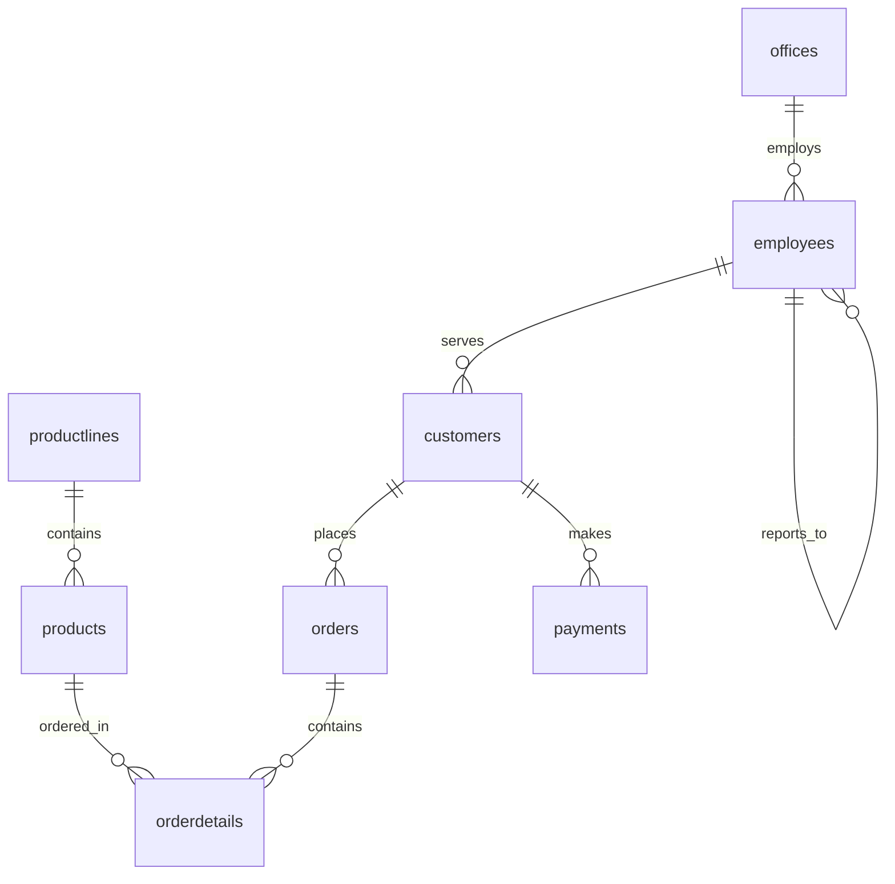
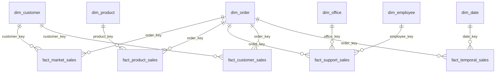
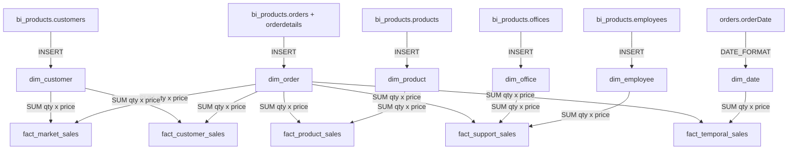

# ETL Pipeline

Extract, Transform, Load scripts that build the `bi_project` star schema from the `bi_products` OLTP source database.

## Files

| File | Purpose |
|------|---------|
| `products.sql` | Creates `bi_products` — source OLTP database with sample data (ClassicModels) |
| `project.sql` | Creates `bi_project` — star schema with 6 dimension + 5 fact tables |
| `populate_bi_project.sql` | ETL script that populates `bi_project` from `bi_products` |
| `a.sql` through `e.sql` | Individual ETL scripts for each analytical question (development use) |

## Database Schemas

### Source: `bi_products` (OLTP)



Tables: `productlines`, `products`, `offices`, `employees`, `customers`, `orders`, `orderdetails`, `payments`

### Target: `bi_project` (Star Schema)



**Dimension Tables:** `dim_customer`, `dim_order`, `dim_product`, `dim_office`, `dim_employee`, `dim_date`

**Fact Tables:** `fact_market_sales`, `fact_product_sales`, `fact_support_sales`, `fact_customer_sales`, `fact_temporal_sales`

## ETL Flow



## Running

```bash
# 1. Create source database
mysql -u root -p1234 < products.sql

# 2. Create star schema
mysql -u root -p1234 < project.sql

# 3. Run ETL
mysql -u root -p1234 < populate_bi_project.sql
```

## Key Design Decisions

- **Surrogate keys** (`customer_key`, `product_key`, etc.) replace natural keys for faster joins
- **`salesAmount`** is computed as `quantityOrdered × priceEach` during ETL, not at query time
- **`date_key`** uses `YYYYMMDD` integer format for efficient date dimension lookups
- **Separate fact tables** per analytical question optimize each query path
