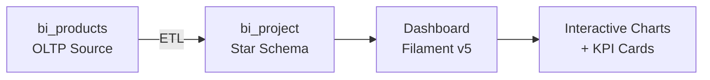

# Business Intelligence Project

A complete BI solution that transforms raw sales data into interactive dashboards, answering five core analytical questions for a model car/collectibles company.

## Project Structure



| Directory | Purpose | Documentation |
|-----------|---------|---------------|
| `ETL/` | Source data, star schema DDL, and ETL scripts | [ETL/README.md](ETL/README.md) |
| `dashboard/` | Laravel + Filament v5 visualization layer | [dashboard/README.md](dashboard/README.md) |

## The Five BI Questions

| # | Question | BI Essence | Chart Type |
|---|----------|-----------|------------|
| A | Which city is the best market for sales? | Geographic market analysis | Bar |
| B | Which product has the highest sales? | Product performance analysis | Pie |
| C | Which office provides the best sales support? | Organizational performance | Horizontal Bar |
| D | Which customer generates the highest revenue? | Customer value analysis | Doughnut |
| E | Which year/month had the highest sales volume? | Temporal trend analysis | Line |

Each chart type is unique to best represent its data.

## Data Coverage

- **2025:** 12 orders (one per month) for year-over-year baseline
- **2026:** 48 orders (3 per month, Jan–Dec) for seasonal trend analysis

## Quick Start

```bash
# 1. Set up the database
mysql -u root -p1234 < ETL/products.sql
mysql -u root -p1234 < ETL/project.sql
mysql -u root -p1234 < ETL/populate_bi_project.sql

# 2. Start the dashboard
cd dashboard
composer install
php artisan filament:assets
php artisan serve
# Visit http://localhost:8000/admin
```

## Tech Stack

- **Database:** MySQL (star schema with 6 dimension + 5 fact tables)
- **Backend:** Laravel 12 + PHP 8.2
- **Frontend:** Filament v5 + Livewire + Chart.js + Alpine.js
- **Source Data:** ClassicModels sample dataset (customers, orders, products, offices)

## Prerequisites

- XAMPP (Apache + MySQL) or equivalent
- PHP 8.2+ with `intl` and `zip` extensions
- Composer 2.x
