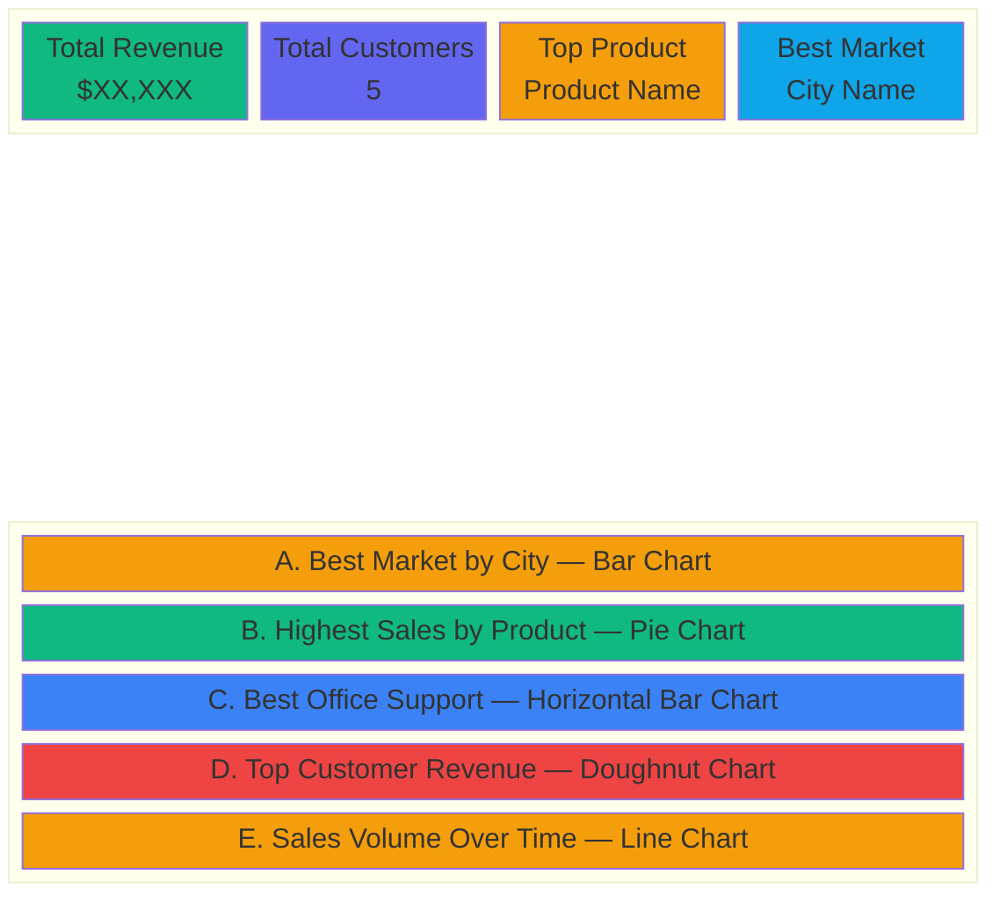

# BI Dashboard

Filament v5 dashboard visualizing the `bi_project` star schema. Answers five BI questions through interactive charts with KPI summary cards.

## Setup

```bash
composer install
php artisan filament:assets
php artisan serve
# Visit http://localhost:8000/admin
```

Requires `bi_project` database populated via `ETL/populate_bi_project.sql`.

## Dashboard Layout



## File Structure

```
app/Filament/
├── Pages/
│   └── Dashboard.php              # Year filter, grid layout
├── Widgets/
│   ├── BiStatsOverviewWidget.php   # 4 KPI stat cards
│   ├── BestCityMarketWidget.php    # A: Bar — sales by city (filter: country)
│   ├── HighestProductSalesWidget.php # B: Pie — sales by product (filter: product line)
│   ├── BestOfficeSupportWidget.php # C: Horizontal Bar — sales by office
│   ├── TopCustomerWidget.php       # D: Doughnut — sales by customer (filter: country)
│   └── TemporalSalesWidget.php     # E: Line — sales over time (filter: year)
└── Providers/Filament/
    └── AdminPanelProvider.php      # Panel config, widget registration
```

## Widgets

| Widget | Chart Type | Filter | Query Pattern |
|--------|-----------|--------|---------------|
| BiStatsOverview | KPI cards | — | Aggregates across all fact tables |
| A. Best City Market | Bar | Country | `fact_market_sales` → `dim_customer` → group by city |
| B. Highest Product Sales | Pie | Product Line | `fact_product_sales` → `dim_product` → group by product |
| C. Best Office Support | Horizontal Bar | — | `fact_support_sales` → `dim_office` → group by office |
| D. Top Customer Revenue | Doughnut | Country | `fact_customer_sales` → `dim_customer` → group by customer |
| E. Sales Volume Over Time | Line | Year | `fact_temporal_sales` → `dim_date` → group by year+month |

All chart types are unique. All widgets are collapsible and full-width.

## Data Coverage

- **2025:** 12 orders (one per month) for year-over-year baseline
- **2026:** 48 orders (3 per month, Jan–Dec) for seasonal trend analysis

## Tech Stack

- Laravel 12 + Filament v4
- Livewire (reactive filters)
- Chart.js (visualizations)
- MySQL (`bi_project` star schema)

## Documentation

See `docs/DOCUMENTATION.md` for comprehensive documentation including BI concepts, data flow, and architectural decisions.

## Contributors

- **Phillip** — Project Lead & Developer
