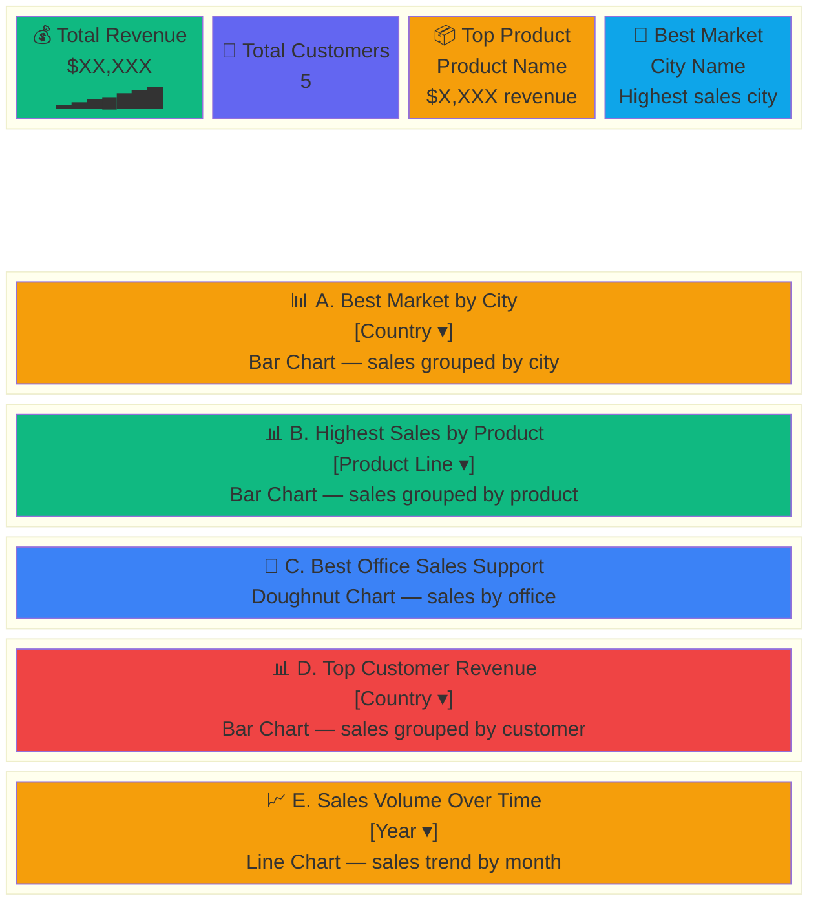

# BI Dashboard — Comprehensive Documentation

## 1. What This Project Is

A **Business Intelligence dashboard** built with Laravel + Filament v5 that visualizes sales data from a star schema database. It answers five core BI questions through interactive charts, with KPI summary cards at the top.

**Tech stack:** Laravel 12, Filament v5, Livewire, Chart.js, MySQL, Alpine.js

---

## 2. How It Was Built — Conceptual Walkthrough

### 2.1 The Data Layer: Star Schema

Before any visualization, the data must be structured for analysis. The project uses a **star schema** — the standard BI pattern where:

- **Fact tables** hold measurable numbers (sales amounts, quantities)
- **Dimension tables** hold descriptive attributes (who, what, where, when)

```
                    dim_customer
                         │
dim_product ─── fact_product_sales
                         │
dim_office ──── fact_support_sales ──── dim_employee
                         │
dim_customer ── fact_customer_sales
                         │
dim_date ────── fact_temporal_sales
```

Every fact table's `salesAmount` is computed as `quantityOrdered × priceEach` during ETL. The surrogate keys (`customer_key`, `product_key`, etc.) replace natural keys for faster joins.

### 2.2 The ETL Pipeline

Raw operational data lives in `bi_products` (a classic OLTP schema with customers, orders, products, etc.). The `populate_bi_project.sql` script transforms it:

1. **Extract** — Pull distinct values from `bi_products` tables
2. **Transform** — Compute `salesAmount`, generate `date_key` from `orderDate`, map natural keys to surrogate keys
3. **Load** — Insert into `bi_project` dimension and fact tables

This one-time ETL creates a read-optimized analytical database separate from the operational one.

### 2.3 The Application Layer: Filament Widgets

Each BI question maps to a Filament `ChartWidget` that:
1. Queries the relevant fact + dimension tables via Laravel's query builder
2. Groups by a dimension attribute (city, product name, etc.)
3. Aggregates with `SUM(salesAmount)`
4. Returns Chart.js-compatible `labels` and `datasets` arrays
5. Renders as an interactive chart (bar, line, or doughnut)

The dashboard uses a `StatsOverviewWidget` for KPI cards at the top — quick at-a-glance metrics before the detailed charts.

### 2.4 The Interaction Layer: Filters

Each widget has a `getFilters()` method that queries distinct values from dimension tables and presents them as a dropdown. When a user selects a filter:
1. Livewire captures the selection
2. `$this->filter` is updated
3. `getData()` re-runs with a `WHERE` clause on the selected value
4. Chart.js re-renders with filtered data

The dashboard page also has a year filter at the top level via `filtersForm()`.

---

## 3. The Five BI Questions — Essence and Purpose

### A. Which city is the best market for sales?

**BI Essence:** *Geographic market analysis*

This answers **where** the money comes from. Businesses need to know which cities generate the most revenue to:
- Allocate marketing budgets geographically
- Decide where to open new offices or stores
- Understand regional demand patterns
- Identify underperforming markets that need attention

**How it works:** Joins `fact_market_sales` → `dim_customer`, groups by `city`, sums `salesAmount`. The country filter lets you drill into specific markets.

**Chart type:** Bar chart — easy to compare city-to-city at a glance.

---

### B. Which product has the highest sales?

**BI Essence:** *Product performance analysis*

This answers **what** sells best. Critical for:
- Inventory management (stock more of what sells)
- Product development (invest in popular categories)
- Discontinuation decisions (drop underperformers)
- Pricing strategy (high sellers may tolerate price increases)

**How it works:** Joins `fact_product_sales` → `dim_product`, groups by `productName`, sums `salesAmount`. The product line filter lets you compare within categories (e.g., "Classic Cars" vs "Motorcycles").

**Chart type:** Bar chart — ranked comparison of products.

---

### C. Which office provides the best sales support?

**BI Essence:** *Organizational performance analysis*

This answers **who** drives sales internally. Important for:
- Recognizing high-performing teams
- Identifying offices that need training or resources
- Understanding which locations have the best sales infrastructure
- Benchmarking office performance against each other

**How it works:** Joins `fact_support_sales` → `dim_office` (via `dim_employee`), groups by office city, sums `salesAmount`. The chain is: order → customer → sales rep → office.

**Chart type:** Doughnut chart — shows proportional contribution of each office.

---

### D. Which individual customer generates the highest sales revenue?

**BI Essence:** *Customer value analysis (RFM - Recency, Frequency, Monetary)*

This answers **who** the best customers are. Essential for:
- VIP customer retention programs
- Sales team focus (prioritize high-value accounts)
- Customer segmentation (wholesale vs retail)
- Churn prevention ( losing a top customer is costly)

**How it works:** Joins `fact_customer_sales` → `dim_customer`, groups by `customerName`, sums `salesAmount`. The country filter lets you analyze customer value by region.

**Chart type:** Bar chart — ranked comparison of customer revenue.

---

### E. Which historical year and month experienced the highest sales volume?

**BI Essence:** *Temporal/trend analysis*

This answers **when** sales peaked. Vital for:
- Seasonal planning (staff up before peak months)
- Year-over-year growth tracking
- Identifying trends (is the business growing or declining?)
- Forecasting future demand based on historical patterns

**How it works:** Joins `fact_temporal_sales` → `dim_date`, groups by `year` + `month_name`, sums `salesAmount`. The year filter lets you focus on specific periods.

**Chart type:** Line chart with fill — shows the trend over time, with area filled to emphasize volume.

---

## 4. Dashboard Architecture



---

## 5. File Responsibilities

| File | Role |
|------|------|
| `AdminPanelProvider.php` | Wires everything together: registers pages, widgets, middleware |
| `Dashboard.php` | Customizes the dashboard page layout and adds year filter |
| `BiStatsOverviewWidget.php` | Computes and displays 4 KPI summary cards |
| `BestCityMarketWidget.php` | Bar chart — sales grouped by city, filterable by country |
| `HighestProductSalesWidget.php` | Bar chart — sales grouped by product, filterable by product line |
| `BestOfficeSupportWidget.php` | Doughnut chart — sales grouped by office location |
| `TopCustomerWidget.php` | Bar chart — sales grouped by customer, filterable by country |
| `TemporalSalesWidget.php` | Line chart — sales over time, filterable by year |

---

## 6. Key Concepts

### Star Schema vs. OLTP
The source database (`bi_products`) is OLTP — optimized for transactions. The analytical database (`bi_project`) is a star schema — optimized for reads and aggregations. The ETL bridges the two.

### Surrogate Keys
Dimension tables use auto-increment surrogate keys (`customer_key`, `product_key`) instead of natural keys (`customerNumber`, `productCode`). This simplifies joins and isolates the warehouse from source system key changes.

### Measure vs. Dimension
- **Measures** are numbers you aggregate: `salesAmount`, `quantityOrdered`
- **Dimensions** are attributes you group by: `city`, `productName`, `year`

### Filter Chain
When a user selects "USA" in Widget A's country filter:
1. `$this->filter` is set to `"USA"`
2. `getData()` adds `->where('dim_customer.country', 'USA')`
3. The query now only returns cities in the USA
4. Chart.js re-renders with the filtered dataset

---

## 7. Running the Dashboard

1. Start Apache + MySQL in XAMPP
2. Visit `http://localhost/DIT2/bi/project/dashboard/public/admin`

```bash
# Re-import data if needed
mysql -u root -p1234 < project.sql
mysql -u root -p1234 < populate_bi_project.sql

# Clear caches
php artisan cache:clear && php artisan config:clear && php artisan view:clear

# Check routes
php artisan route:list --path=admin
```
